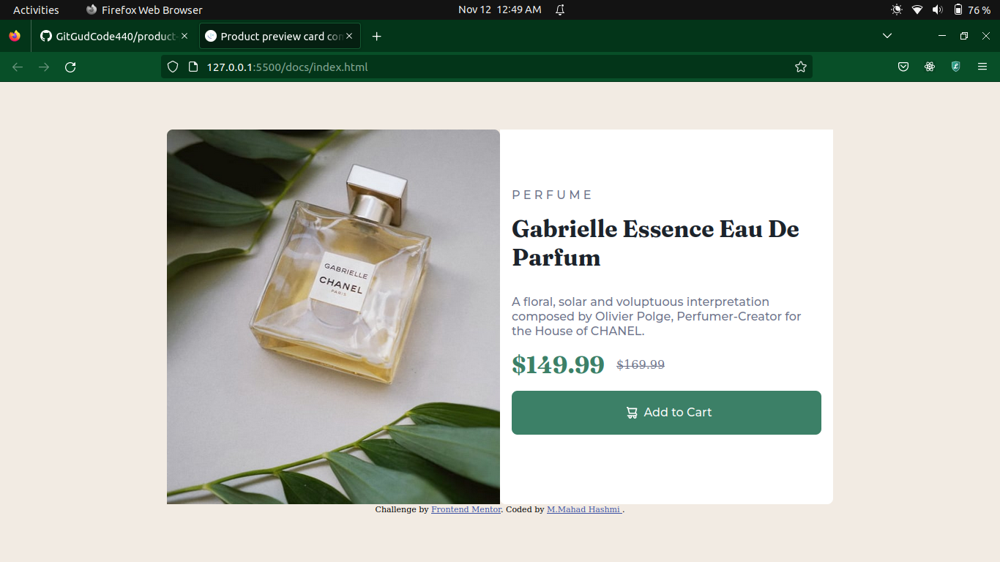

# Frontend Mentor - Product preview card component solution

This is a solution to the [Product preview card component challenge on Frontend Mentor](https://www.frontendmentor.io/challenges/product-preview-card-component-GO7UmttRfa). Frontend Mentor challenges help you improve your coding skills by building realistic projects. 

## Table of contents

- [Overview](#overview)
  - [The challenge](#the-challenge)
  - [Screenshot](#screenshot)
  - [Links](#links)
- [My process](#my-process)
  - [Built with](#built-with)
  - [What I learned](#what-i-learned)
  - [Useful resources](#useful-resources)
- [Author](#author)

## Overview

### The challenge

Users should be able to:

- View the optimal layout depending on their device's screen size
- See hover and focus states for interactive elements

### Screenshot

### Links

- Solution URL: [Solution on GitHub here](https://github.com/GitGudCode440/product-preview-card-component-main)
- Live Site URL: [Site hostedon GitHub Pages here](https://gitgudcode440.github.io/product-preview-card-component-main/)

## My process

### Built with

- Semantic HTML5 markup
- CSS styling
- Flexbox
- CSS Grid

### What I learned

I learned about how to set a content of a page to exact center of the page in regards of width and height.
And also which unit to use on width and height(percentage, and viewport height respectively).
I also learned about box-sizing property in CSS, which I used to full advantage in the project.
The only thing I didn't learn is how to cure my stupidity :p.

### Useful resources

- [Example resource 1](https://www.youtube.com/watch?v=dpuKVjX6BJ8) - Resource for learning how to set full width and height of a page of an HTML element.

## Author

- M. Mahad Hashmi

- GitHub - [GitGudCode440](https://github.com/GitGudCode440)

